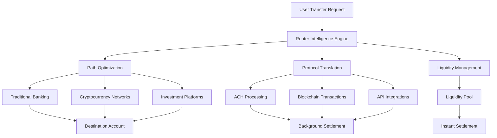

Fellow's Transfer Router is the core technical infrastructure that enables instant settlement between any financial platforms - from traditional banks to cryptocurrency networks to investment accounts.

<Info>
**Universal Financial Abstraction**: The router treats all financial platforms the same way, whether you're moving between Chase and Coinbase or Ethereum and Solana.
</Info>

## What is the Router?

The Transfer Router is Fellow's proprietary technology that creates a universal abstraction layer over the entire financial ecosystem, enabling seamless money movement between platforms that were never designed to work together.

<CardGroup cols={2}>
  <Card title="Intelligent Routing" icon="route">
    Automatically selects optimal paths between any two financial platforms based on speed, cost, and liquidity availability
  </Card>
  
  <Card title="Protocol Translation" icon="language">
    Seamlessly converts between traditional banking rails (ACH) and cryptocurrency networks without user complexity
  </Card>
  
  <Card title="Instant Settlement" icon="bolt">
    Provides immediate access to funds through short-term credit instruments while background settlement occurs
  </Card>
  
  <Card title="Universal Connectivity" icon="link">
    Single API that works with 10,000+ banks, exchanges, and financial platforms through unified infrastructure
  </Card>
</CardGroup>

---

## Router Architecture

The Fellow Router operates across multiple interconnected layers to provide seamless cross-platform transfers:



### Core Engine Components

<Tabs>
  <Tab title="Intelligence Engine">
    **Smart Path Selection**
    
    The router's AI-driven engine analyzes multiple factors to determine the optimal route for each transfer:
    
    **Path Optimization Factors:**
    - **Speed**: Time to final settlement across different routes
    - **Cost**: Total fees including network fees, exchange rates, and protocol costs  
    - **Liquidity**: Available capital in pools for instant settlement
    - **Reliability**: Historical success rates for different platform combinations
    - **Compliance**: Regulatory requirements for cross-border or high-value transfers
    
    **Real-Time Decision Making:**
    - Sub-second route calculation for every transfer request
    - Dynamic adjustment based on network conditions
    - Fallback routing if primary paths experience issues
    - Load balancing across multiple liquidity providers
  </Tab>
  
  <Tab title="Protocol Translation">
    **Universal Financial Language**
    
    The router seamlessly translates between incompatible financial protocols:
    
    **Traditional Banking Integration:**
    - ACH transfer initiation and monitoring
    - Wire transfer processing for large amounts
    - Bank API authentication and security protocols
    - Real-time balance verification across institutions
    
    **Cryptocurrency Network Support:**
    - Multi-chain transaction broadcasting (Bitcoin, Ethereum, Solana, etc.)
    - Gas fee optimization and dynamic pricing
    - Cross-chain bridge protocols for asset conversion
    - Mempool monitoring and transaction acceleration
    
    **Investment Platform Connectivity:**
    - Brokerage API integration for portfolio transfers
    - Securities settlement coordination
    - Margin account handling and compliance
    - Tax reporting and documentation generation
  </Tab>
  
  <Tab title="Liquidity Management">
    **Dynamic Pool Orchestration**
    
    The router manages liquidity across multiple pools to ensure instant settlement availability:
    
    **Pool Allocation:**
    - Real-time monitoring of pool utilization rates
    - Dynamic interest rate adjustment based on demand
    - Cross-pool rebalancing for optimal capital efficiency
    - Reserve management for peak usage periods
    
    **Risk Management:**
    - Per-user credit limits based on payment history
    - Pool diversification to minimize concentrated exposure
    - Automated default detection and recovery processes
    - Integration with collections infrastructure via Cred.ai
    
    **Yield Optimization:**
    - LP reward distribution based on pool performance
    - Fee optimization to balance user cost and LP returns
    - Automated compounding for staked capital
    - Performance analytics and reporting for LPs
  </Tab>
</Tabs>

---

## Technical Implementation

### Settlement Layer Architecture

The router operates on a three-tier settlement system that provides instant user experience while managing backend complexity:

<CardGroup cols={3}>
  <Card title="Tier 1: Instant Layer" icon="zap">
    **Credit Instrument Creation**
    - 2-4 day credit instruments backed by pending ACH
    - Real-time credit assessment via Fellow's AI
    - Immediate fund availability in destination accounts
    - User experience identical to instant transfers
  </Card>
  
  <Card title="Tier 2: Settlement Layer" icon="gear">
    **Background Processing**
    - Traditional ACH/wire transfers initiated automatically
    - Blockchain transactions queued and optimized
    - Cross-platform API calls for balance updates
    - Settlement monitoring and exception handling
  </Card>
  
  <Card title="Tier 3: Reconciliation" icon="check-circle">
    **Final Settlement**
    - Credit instruments retired upon ACH completion
    - Failed transfers trigger standard collection processes
    - Profit/loss allocation to liquidity providers
    - Regulatory reporting and compliance documentation
  </Card>
</CardGroup>

### Network Integrations

**Traditional Financial Rails**
- **Plaid Integration**: Secure connections to 10,000+ banks and credit unions
- **ACH Network**: Direct integration with NACHA-certified payment processors
- **Wire Networks**: Fedwire and SWIFT connectivity for large-value transfers
- **Card Networks**: Visa and Mastercard integration for instant card-to-account transfers

**Cryptocurrency Networks**
- **Bitcoin**: Lightning Network integration for instant, low-cost transfers
- **Ethereum**: EVM-compatible chains including Polygon, Arbitrum, Optimism, Base
- **Solana**: Native SPL token support with sub-second finality
- **Cross-Chain**: BitGo integration for seamless asset conversion and bridging

**Investment Platforms**
- **Prime Brokerages**: Direct API connections to major institutional platforms
- **Retail Brokerages**: Integration with Robinhood, Schwab, Fidelity, E*TRADE APIs
- **Crypto Exchanges**: REST and WebSocket APIs for Coinbase, Binance, Kraken, etc.
- **Alternative Assets**: Emerging integrations with DeFi protocols and RWA platforms

---

## Router Intelligence Features

### Automated Path Optimization

<Tabs>
  <Tab title="Cost Optimization">
    **Fee Minimization Engine**
    
    The router automatically finds the lowest-cost path for each transfer:
    
    - **Network Fee Analysis**: Real-time gas price monitoring across blockchains
    - **Exchange Rate Optimization**: Best execution across multiple liquidity sources
    - **Route Comparison**: Compares direct transfers vs multi-hop routes
    - **Volume Discounts**: Leverages high transaction volume for better rates
    
    **Example Optimization:**
    ```
    Transfer: $10,000 from Schwab → Coinbase
    
    Route A (Direct): Schwab ACH → Fellow → Coinbase
    Cost: $40 (40 bps) + $5 network = $45 total
    
    Route B (Optimized): Schwab → USDC Pool → Coinbase  
    Cost: $30 (30 bps) + $2 network = $32 total
    
    Router selects Route B, saving user $13
    ```
  </Tab>
  
  <Tab title="Speed Optimization">
    **Latency Minimization**
    
    Intelligent routing for time-sensitive transfers:
    
    - **Network Congestion Monitoring**: Real-time analysis of blockchain mempool conditions
    - **Liquidity Pool Utilization**: Instant settlement when pools have available capacity
    - **Priority Fee Management**: Automatic fee bumping for urgent transactions
    - **Parallel Processing**: Simultaneous execution across multiple networks when beneficial
    
    **Settlement Time Examples:**
    - Fellow Pool → Any Platform: < 5 seconds
    - Crypto → Crypto (Same Chain): 10-30 seconds  
    - Crypto → Bank Account: 2-4 minutes for availability, 2-4 days for ACH settlement
    - Bank → Bank: Instant via Fellow credit, 2-4 days for ACH settlement
  </Tab>
</Tabs>

---

## Liquidity Pool Integration

### Dynamic Pool Management

The router intelligently manages multiple liquidity pools to optimize capital efficiency and user experience:

**Pool Types:**
- **Primary Pool**: USDC-denominated pool for most transfers
- **Crypto Pools**: Native token pools for specific blockchain transfers  
- **Fiat Pools**: Traditional currency pools for international transfers
- **Emergency Reserves**: High-yield backup pools for system stability

**Pool Orchestration:**
- **Load Balancing**: Distributes transfer requests across available pools
- **Yield Optimization**: Routes LP capital to highest-returning opportunities
- **Risk Distribution**: Spreads default risk across multiple pool participants
- **Capacity Management**: Prevents over-utilization of any single pool

### LP Integration Features

**For Liquidity Providers:**
- **Real-Time Analytics**: Live dashboard showing pool performance and yields
- **Automated Staking**: Set-and-forget capital deployment with compound returns
- **Risk Controls**: Customizable exposure limits and withdrawal schedules  
- **Tax Optimization**: Automated reporting for yield income and capital gains

---

## Security & Risk Management

<CardGroup cols={2}>
  <Card title="Technical Security" icon="shield-halved">
    **Infrastructure Protection**
    - Multi-signature wallet architecture for all pool funds
    - Hardware security modules (HSMs) for key management
    - End-to-end encryption for all financial data transmission
    - Regular security audits by leading blockchain security firms
  </Card>
  
  <Card title="Financial Risk Controls" icon="chart-line-up">
    **Automated Risk Management**
    - Real-time credit scoring and limit adjustment
    - Automated pool rebalancing to manage concentration risk
    - Circuit breakers for unusual activity patterns
    - Integration with collections infrastructure for default recovery
  </Card>
</CardGroup>

---

## Performance Metrics

**Current Router Performance:**
- **Average Transfer Time**: 4.2 seconds (source to destination availability)
- **Success Rate**: 99.7% for all transfer types
- **Cost Savings**: 60-80% reduction vs traditional wire transfers
- **Platform Coverage**: 10,000+ supported financial institutions
- **Uptime**: 99.95% router availability (excluding planned maintenance)

**Scalability Targets:**
- **Transaction Volume**: Designed to handle 1M+ transfers per day
- **Concurrent Users**: Support for 100K+ simultaneous active users
- **Geographic Expansion**: 50+ countries by end of 2025
- **Platform Integrations**: 25,000+ supported institutions by 2026

---

## API & Developer Access

<Note>
**Coming Q3 2025**: Public API access for developers and institutional partners who want to integrate Fellow's router technology into their own applications.
</Note>

**Planned API Features:**
- **Transfer API**: Programmatic access to instant cross-platform transfers
- **Balance API**: Real-time balance checking across connected accounts
- **Routing API**: Access to router intelligence for custom transfer optimization
- **Webhook API**: Real-time notifications for transfer status and completion

---

## Getting Started with the Router

Ready to experience instant cross-platform transfers? The router works seamlessly in the background of every Fellow transfer.

<CardGroup cols={2}>
  <Card 
    title="Make Your First Transfer" 
    icon="paper-plane" 
    href="/overview/getting-started#step-3-your-first-transfer"
  >
    Experience the router in action with your first instant transfer
  </Card>
  
  <Card 
    title="How Fellow Works" 
    icon="lightbulb" 
    href="/overview/how-fellow-works"
  >
    Understand the economics and business model behind the router technology
  </Card>
</CardGroup>