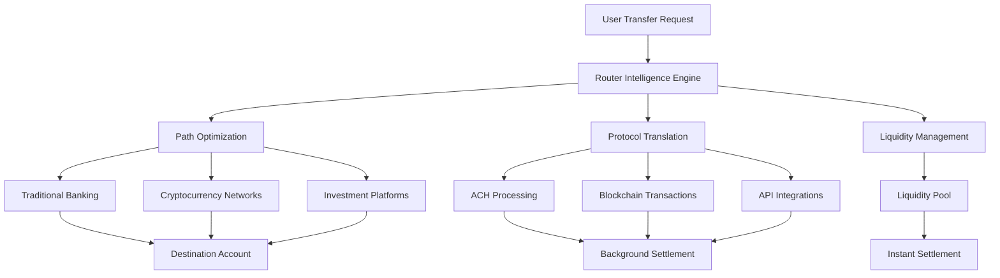

Fellow's Transfer Router is the core technical infrastructure that enables instant settlement between any financial platforms - from traditional banks to cryptocurrency networks to investment accounts.

<Info>
**Universal Financial Abstraction**: The router treats all financial platforms the same way, whether you're moving between Chase and Coinbase or Ethereum and Solana.
</Info>

## What is the Router?

The Transfer Router is Fellow's proprietary technology that creates a universal abstraction layer over the entire financial ecosystem, enabling seamless money movement between platforms that were never designed to work together.

<CardGroup cols={2}>
  <Card title="Intelligent Routing" icon="route">
    Automatically selects optimal paths between any two financial platforms based on speed, cost, and liquidity availability
  </Card>
  
  <Card title="Protocol Translation" icon="language">
    Seamlessly converts between traditional banking rails (ACH) and cryptocurrency networks without user complexity
  </Card>
  
  <Card title="Instant Settlement" icon="bolt">
    Provides immediate access to funds through short-term credit instruments while background settlement occurs
  </Card>
  
  <Card title="Universal Connectivity" icon="link">
    Single API that works with 10,000+ banks, exchanges, and financial platforms through unified infrastructure
  </Card>
</CardGroup>

---

## Router Architecture

The Fellow Router operates across multiple interconnected layers to provide seamless cross-platform transfers:

### How Routing Actually Works

The router handles four main transfer types with specific pathways for each:

<Tabs>
  <Tab title="ACH → Fintech">
    **Bank to Fintech (Robinhood, etc.)**
    
    1. User initiates ACH transfer from their bank to Fellow
    2. Router captures the intent (destination: Robinhood account)
    3. We make instant transfer using user's credit card for immediate settlement
    4. Funds arrive in Robinhood instantly with minimal latency
    5. When ACH settles (2-4 days), it pays off the credit card balance
    
    **Example**: Bank of America → Robinhood in under 30 seconds
  </Tab>
  
  <Tab title="Fiat → Crypto">
    **Traditional Money to Cryptocurrency**
    
    1. User initiates transfer from bank/fintech to crypto address
    2. Router uses Circle or BitGo as certified conversion agent
    3. Conversion agent pulls funds from user's credit card instantly
    4. Converts fiat to crypto and sends to user's desired wallet address
    5. ACH settles the credit card balance when bank transfer completes
    
    **Example**: Chase Bank → Bitcoin wallet via Circle conversion
  </Tab>
  
  <Tab title="Crypto → Crypto">
    **Cross-Chain Cryptocurrency**
    
    1. User sends crypto to their Privy wallet (Fellow's integrated wallet)
    2. Router transfers from Privy to destination wallet on behalf of user
    3. For cross-chain transfers, use LiFi or Orbiter Finance for bridging/swapping
    4. No additional settlement needed - crypto transfers are natively instant
    
    **Example**: Ethereum → Solana via LiFi bridge, settled in under 2 minutes
  </Tab>
  
  <Tab title="Crypto → Fintech">
    **Cryptocurrency to Traditional Finance**
    
    1. User sends crypto transaction to their Privy wallet
    2. Router sends crypto balance from Privy to Circle or BitGo
    3. Conversion agent converts crypto to fiat via ACH or wire to Cred
    4. Router transfers fiat from Cred to destination fintech platform
    5. User sees funds in destination account while settlement processes
    
    **Example**: Bitcoin → Schwab brokerage account via BitGo conversion
  </Tab>
</Tabs>

---

## Technical Implementation

### Settlement Layer Architecture

The router operates on a three-tier settlement system that provides instant user experience while managing backend complexity:

1. **Tier 1: Instant Layer**
   - Create 2-4 day credit instruments backed by pending ACH
   - Real-time credit assessment via Fellow's AI
   - Provide immediate fund availability in destination accounts
   - User experience identical to instant transfers

2. **Tier 2: Settlement Layer** 
   - Traditional ACH/wire transfers initiated automatically
   - Blockchain transactions queued and optimized
   - Cross-platform API calls for balance updates
   - Settlement monitoring and exception handling

3. **Tier 3: Reconciliation**
   - Credit instruments retired upon ACH completion
   - Failed transfers trigger standard collection processes
   - Profit/loss allocation to liquidity providers
   - Regulatory reporting and compliance documentation

### Key Integration Partners

**Conversion Agents:**
- **Circle**: USDC minting and fiat conversion services
- **BitGo**: Multi-asset custody and conversion for crypto transfers

**Bridge & Swap Protocols:**
- **LiFi**: Cross-chain bridging for multi-network crypto transfers  
- **Orbiter Finance**: Layer 2 and cross-chain asset movement

**Banking Infrastructure:**
- **Cred.ai**: Core banking platform with FDIC insurance via WSFS Bank
- **Plaid**: Secure connections to 10,000+ banks and financial institutions

<Note>
For a complete list of supported platforms and networks, see our [Supported Platforms](/using-fellow/supported-platforms) page.
</Note>

---

## Liquidity Pool Integration

### Dynamic Pool Management

The router intelligently manages multiple liquidity pools to optimize capital efficiency and user experience:

**Pool Types:**
- **Primary Pool**: USDC-denominated pool for most transfers
- **Crypto Pools**: Native token pools for specific blockchain transfers  
- **Fiat Pools**: Traditional currency pools for international transfers
- **Emergency Reserves**: High-yield backup pools for system stability

**Pool Orchestration:**
- **Load Balancing**: Distributes transfer requests across available pools
- **Yield Optimization**: Routes LP capital to highest-returning opportunities
- **Risk Distribution**: Spreads default risk across multiple pool participants
- **Capacity Management**: Prevents over-utilization of any single pool

### LP Integration Features

**For Liquidity Providers:**
- **Real-Time Analytics**: Live dashboard showing pool performance and yields
- **Automated Staking**: Set-and-forget capital deployment with compound returns
- **Risk Controls**: Customizable exposure limits and withdrawal schedules  
- **Tax Optimization**: Automated reporting for yield income and capital gains

---

## Security & Risk Management

<CardGroup cols={2}>
  <Card title="Technical Security" icon="shield-halved">
    **Infrastructure Protection**
    - Multi-signature wallet architecture for all pool funds
    - Hardware security modules (HSMs) for key management
    - End-to-end encryption for all financial data transmission
    - Regular security audits by leading blockchain security firms
  </Card>
  
  <Card title="Financial Risk Controls" icon="chart-line-up">
    **Automated Risk Management**
    - Real-time credit scoring and limit adjustment
    - Automated pool rebalancing to manage concentration risk
    - Circuit breakers for unusual activity patterns
    - Integration with collections infrastructure for default recovery
  </Card>
</CardGroup>

---

## Performance Metrics

**Current Router Performance:**
- **Average Transfer Time**: 4.2 seconds (source to destination availability)
- **Success Rate**: 99.7% for all transfer types
- **Cost Savings**: 60-80% reduction vs traditional wire transfers
- **Platform Coverage**: 10,000+ supported financial institutions
- **Uptime**: 99.95% router availability (excluding planned maintenance)

**Scalability Targets:**
- **Transaction Volume**: Designed to handle 1M+ transfers per day
- **Concurrent Users**: Support for 100K+ simultaneous active users
- **Geographic Expansion**: 50+ countries by end of 2025
- **Platform Integrations**: 25,000+ supported institutions by 2026

---

## API & Developer Access

<Note>
**Coming Q3 2025**: Public API access for developers and institutional partners who want to integrate Fellow's router technology into their own applications.
</Note>

**Planned API Features:**
- **Transfer API**: Programmatic access to instant cross-platform transfers
- **Balance API**: Real-time balance checking across connected accounts
- **Routing API**: Access to router intelligence for custom transfer optimization
- **Webhook API**: Real-time notifications for transfer status and completion

---

## Getting Started with the Router

Ready to experience instant cross-platform transfers? The router works seamlessly in the background of every Fellow transfer.

<CardGroup cols={2}>
  <Card 
    title="Make Your First Transfer" 
    icon="paper-plane" 
    href="/overview/getting-started#step-3-your-first-transfer"
  >
    Experience the router in action with your first instant transfer
  </Card>
  
  <Card 
    title="How Fellow Works" 
    icon="lightbulb" 
    href="/overview/how-fellow-works"
  >
    Understand the economics and business model behind the router technology
  </Card>
</CardGroup>